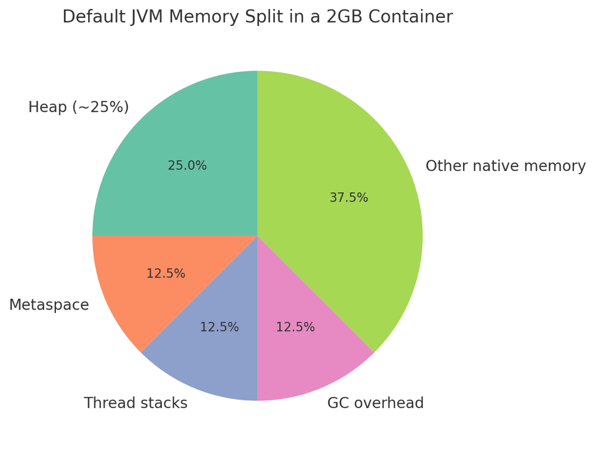

# JVM

## Containerized java applications

### Background
When running Java apps in containers (including OpenShift/Kubernetes), memory allocation can be tricky. 
Historically, the JVM tried to allocate heap based on the host’s memory, which could lead to problems if the 
container had less memory available → other apps might get OOM (Out Of Memory) errors.

Since Java 11 onward, the JVM became container-aware. That means it respects cgroup memory limits set by 
Kubernetes/OpenShift (e.g., the resources.limits.memory in your Pod spec).

The problem usually appears if:
1.	You don’t set proper resource requests/limits in your deployment.
2.	You let the JVM use defaults, which may not be optimal (heap may still be too large for the container).

### Heap

The heap is the portion of memory managed by the JVM where all objects are allocated.
This includes everything your application creates with new:
- Domain objects (User, Order, etc.)
- DTOs for REST requests/responses
- Collections (like ArrayList, HashMap)
- Cached objects
- Framework-related objects (Spring beans, proxies, reflection data)

Key point: Heap is for object storage, not primitives on the stack (like local variables in a method).

GC pause?
With a GC that stops the world often, the job may spend 10–20% of time paused → throughput drops to 80–90%.

Example of “large heap”:
- Your batch application is allocated 32GB JVM heap to process huge datasets.
- During processing, it creates lots of temporary objects (records, DTOs, calculations).
- Parallel GC will use all CPU cores to clean this 32GB heap faster than a single-threaded GC like Serial GC.

### Details

✅ What happens with just Kubernetes/OpenShift limits
- When you set resources.requests/limits.memory, Kubernetes enforces those as cgroup limits on the container.
- So your container cannot exceed that limit — if it does, it gets killed with an OOMKilled error.
- The JVM (since Java 10+, including Java 21) is container-aware, so it will detect the container’s memory limit 
  and size its heap accordingly.

```
containers:
    resources:
        limits:
            memory: 2Gi
        requests:
            cpu: 200m
            memory: 2Gi
```

⚠️ Why you still might need JVM flags

Even though Java 21 is container-aware, the default rule may not match your workload:
- By default, the JVM sets Max Heap = 25% of available container memory. 
  Example: If the container has 2GB, JVM heap = ~512MB.
- The remaining memory is reserved for Metaspace, JIT compiler, thread stacks, GC overhead, buffers, etc.
- If your application actually needs more heap and less “other” memory, the default split wastes memory.
- Conversely, if the heap is too big, the JVM may still hit the cgroup limit when non-heap usage grows → boom, OOMKilled.

That’s why you sometimes need to override with flags like:

```
-XX:MaxRAMPercentage=70   # give heap 70% of container memory instead of 25%
-XX:InitialRAMPercentage=50
-XX:MaxMetaspaceSize=256m
```

## Summary
Even with Java 21, the JVM doesn’t just use all the container’s memory for the heap. By default it takes ~25% 
for heap and reserves the rest for non-heap areas. That split isn’t always what our apps need. 
Kubernetes limits stop the container from using more than what’s defined, but they don’t tell the JVM how to balance 
heap vs non-heap. That’s why we often tune JVM flags to avoid OOMs or underutilization.



### Java 21 GC - Spring Boot Applications

| Application Type / Use Case                                    | Recommended GC      | Strengths                                                                                  | Considerations / Notes                                                                 |
|----------------------------------------------------------------|------------------|--------------------------------------------------------------------------------------------|----------------------------------------------------------------------------------------|
| **Standard REST microservice**                                 | **G1GC**          | Balanced throughput and low-latency; default in Java 21; predictable pauses                | Good starting point; tune pause target if needed                                       |
| **High throughput batch processing**                            | **Parallel GC**   | Maximizes CPU for throughput; efficient for batch jobs with large heaps                    | Longer GC pauses; not ideal for low-latency requirements                               |
| **Low-latency API services (WebFlux reactive)**                | **ZGC**           | Ultra-low pause times, scalable heaps; suitable for reactive systems                        | Slightly higher footprint; tuning is simpler in Java 21                                 |
| **Memory-intensive microservices (large caches, integrations)**| **Shenandoah**    | Concurrent evacuation; low pause times for large heaps                                      | Can increase CPU usage; monitor throughput impact                                       |
| **Highly concurrent services with variable load**              | **G1GC** / **ZGC**| G1GC: good default; ZGC: better for unpredictable large heaps                               | ZGC requires Java 21+; G1GC still widely used and stable                               |
| **Integration-heavy services with many external calls**        | **G1GC**          | Predictable and stable; works well with Spring Boot; easy to tune GC logging               | Ensure heap and pause targets match expected request load                               |
| **Reactive streaming with backpressure**                        | **ZGC**           | Low-latency GC keeps reactive pipelines smooth                                             | Monitor footprint; reactive streams can accumulate objects quickly                     |
| **Prototype / small-scale services**                            | **G1GC**          | Default, safe choice; low tuning overhead                                                 | Sufficient for small services; minimal GC configuration needed                          |

## Notes / Recommendations

1. **Default GC in Java 21**: G1GC – works well for most Spring Boot microservices.
2. **ZGC**: Recommended if your service is reactive (Spring WebFlux) and needs minimal pauses.
3. **Shenandoah**: Excellent for very large heaps (>16GB) with moderate CPU availability.
4. **Monitoring**: Always combine GC choice with **heap sizing, GC logs, and JFR (Java Flight Recorder)** for production tuning.
5. **Reactive Microservices**: ZGC shines with WebFlux because it minimizes thread-blocking pauses.
6. **Cloud / Containerized Deployments**: Consider memory footprint and container limits; G1GC or ZGC recommended.  